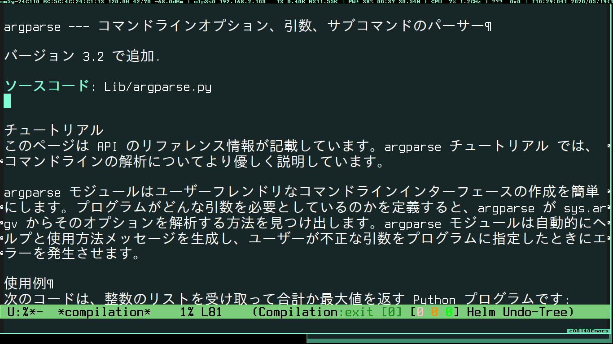

==================================
Project description
==================================

The name of this program is pman.

This program is used to check python modules, built-in functions,
etc. in the shell using the official documentation.

You can also use pman on emacs by setting emacs.

==================================                

-----------------------------------
Image of using pman on emacs
-----------------------------------

	   
-----------------------------------
